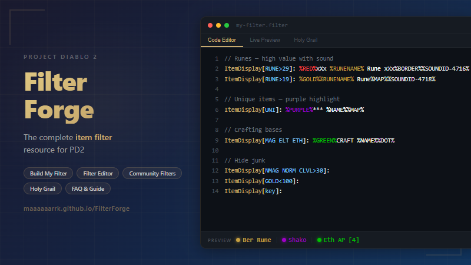

# Filter Forge



Build, edit, and learn Project Diablo 2 item filters, right in your browser.

**[Live Site](https://maaaaaarrk.github.io/FilterForge/)** | **[Report an Issue](https://github.com/Maaaaaarrk/FilterForge/issues)**

## What is Filter Forge?

Filter Forge is a community resource for [Project Diablo 2](https://www.projectdiablo2.com/) item filters. It helps players understand, choose, customize, and create their own loot filters.

## Features

### FAQ
Searchable FAQ with 75+ questions covering everything from installation to advanced syntax. Real-time search with tags, two-level accordion (groups + questions), auto-expand on few results, and deep-linkable via `?search=term` or `#question-id`.

### Build My Filter
A 7-step wizard that generates a complete custom filter based on your choices:
- Class selection (Amazon, Sorceress, Necromancer, Paladin, Barbarian, Druid, Assassin)
- Experience level / strictness (New, Casual, Experienced, Endgame)
- Notification preferences (map icons, sounds, big notifications)
- Extra info (socket counts, item level, vendor price, crafting info, ethereal tags)
- Runeword base highlighting
- Consumable hiding options

### Filter Editor
Full-featured editor for creating and modifying `.filter` files:
- **Visual Rule Builder** — click-to-build filter rules with conditions, colors, map icons, sounds
- **Code Editor** — with line numbers, tab support, and auto-save to localStorage
- **Live Preview** — test rules against 76 predefined items to see the label as it shows in game (colors, line order) and the chain of matching rules; uses the same engine as the Compare page (`js/filter-engine.js`)
- **Import from Author** — download filters directly from community authors (18 authors, 108 filter files)
- **Import/Export** — import `.filter` files from disk or export your work
- **Templates** — starter, endgame, rune, crafting, and mapping templates

### Community Filters
Browse all community-maintained filters available in the PD2 launcher, with how many filter files each author offers, links to their GitHub repositories, and one-click loading into the editor.

### Compare Filters
A birds-eye view of the same drops (runes and currency, a range of unidentified uniques and sets, top bases, rare body armor and circlets, full rejuvs) as every community filter shows them, one column per author. Each column has its own filter file and filter level; columns can be hidden or duplicated to put two levels or files of one filter side by side. Labels are evaluated in the browser by `js/filter-engine.js`. The URL keeps the layout as a short diff from the defaults (`?except=`, `?set=`, or `?only=`), so a head to head can be shared.

### Getting Started Guide
Step-by-step tutorial covering filter installation, in-game setup, basic syntax, and first edits.

## Tech Stack

- Pure HTML/CSS/JS — no frameworks, no build step
- Static site deployable to GitHub Pages
- All data inline or in local JSON files under `data/`
- Dark Diablo 2 themed design with gold accents, in two styles: **Modern** (the default) and **Retro** (pixel fonts and chunky borders). The toggle in the nav switches between them and remembers your choice.

## Running Locally

Serve the folder over HTTP:

```bash
python -m http.server 8000
```

Then visit `http://localhost:8000`.

Opening `index.html` straight from disk (`file://`) works for most pages, but browsers block `fetch()` of local files there, so the Community Filters page cannot load its list that way.

`tools/splash.html` is the source for `splash.png` (the README and link-preview image); it is not deployed.

## Deploying

Push to GitHub and enable Pages (Settings > Pages > Source: GitHub Actions). The included workflow at `.github/workflows/deploy-pages.yml` copies only the site files (pages, `css/`, `js/`, `data/`, `fonts/`, images) into the published artifact, checks that every local file a page references is present, and deploys it. New top-level asset folders need adding to that workflow.

## Content Sources

- Filter syntax documentation based on the [PD2 Wiki - Item Filtering](https://wiki.projectdiablo2.com/wiki/Item_Filtering)
- Community filter list from [PD2 LootFilters](https://github.com/Project-Diablo-2/LootFilters), via the [Maaaaaarrk/LootFilters](https://github.com/Maaaaaarrk/LootFilters) fork
- Filter patterns analyzed from community filters by Wolfie, Kryszard, Kassahi, Erazure, HiimFilter, Dauracul, Sven, PreyInstinct, and Phyx10n

## Contributing

Contributions are welcome! Please [open an issue](https://github.com/Maaaaaarrk/FilterForge/issues) for bugs, suggestions, or new FAQ questions.

## License

This is a community project for Project Diablo 2. Not affiliated with Blizzard Entertainment or Project Diablo 2.
